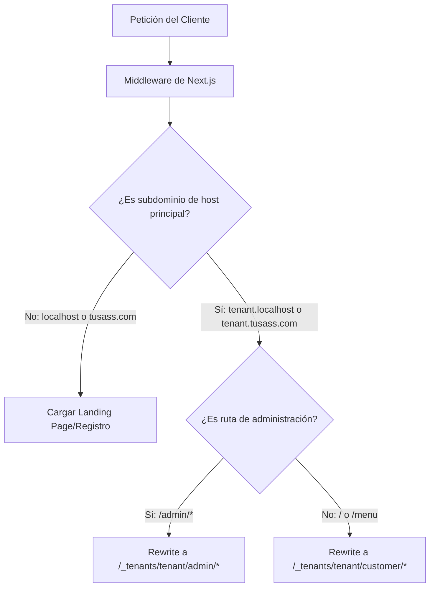

# Referencia de Arquitectura Frontend - SaaS Multi-Tenant de Restaurantes

Este documento sirve como la especificación de referencia y guía de diseño técnico para el desarrollo del frontend de la plataforma SaaS.

---

## 🎯 1. Estrategia Multi-Tenant (Subdominios Dinámicos)

La aplicación resolverá dinámicamente el tenant (restaurante) a partir de la URL utilizando un **Next.js Middleware**.

### Flujo de Resolución de URL


### Configuración del Middleware
- El middleware extraerá el host del header `x-forwarded-host` o `host`.
- Identificará si es un subdominio válido (distinto de `www`, `app`, o del dominio principal).
- Realizará un `NextResponse.rewrite` interno hacia la ruta del Route Group dinámico `/_tenants/[tenant]`, manteniendo limpia la URL en el navegador del usuario.

---

## 📁 2. Estructura de Directorios Propuesta (App Router)

Implementaremos una estructura que separe claramente las responsabilidades del Comensal y del Administrador utilizando carpetas internas bajo Route Groups dinámicos.

```text
src/
├── middleware.ts                 # Interceptor de subdominios y redirección/rewrites
├── app/
│   ├── (marketing)/              # Dominio principal (tusass.com)
│   │   ├── page.tsx              # Landing page comercial
│   │   └── layout.tsx
│   └── _tenants/[tenant]/        # Rutas dinámicas reescritas por el middleware
│       ├── layout.tsx            # Contexto común del tenant (config, info básica)
│       ├── customer/             # 1. El Comensal (Menú Digital)
│       │   ├── page.tsx          # Menú interactivo (QR)
│       │   ├── cart/             # Carrito de compras
│       │   └── layout.tsx
│       └── admin/                # 2. El Administrador (Panel Dashboard)
│           ├── login/            # Autenticación administrativa
│           ├── dashboard/        # Métricas rápidas
│           ├── kitchen/          # Monitor de Cocina en Tiempo Real (WebSockets)
│           ├── menu-management/  # Gestión de platillos y categorías
│           └── layout.tsx        # Layout privado con Sidebar e inyección de token JWT
├── components/                   # Componentes compartidos y atómicos
│   ├── ui/                       # Componentes visuales genéricos
│   ├── customer/                 # Componentes específicos del menú del comensal
│   └── admin/                    # Componentes específicos del dashboard
├── hooks/                        # Custom hooks (useCart, useWebSocket, etc.)
├── context/                      # React Context API para estado global ligero
├── store/                        # Zustand stores (opcional si requerimos modularidad)
├── lib/                          # Utilidades, configuración de Axios/Fetch y API clients
└── types/                        # Tipado estricto de TypeScript
```

---

## 📐 3. Reglas Técnicas y Restricciones Obligatorias

### 1. Tipado TypeScript Estricto
- Queda prohibido el uso de `any`. Todos los tipos provenientes del Backend (Spring Boot) deben tener sus correspondientes interfaces definidas en `types/`.
- Tipar explícitamente los payloads de llamadas de API y eventos de WebSocket.

### 2. Estilos con Tailwind CSS (Mobile-First)
- **Comensal (Público):** Diseñado con enfoque exclusivo en dispositivos móviles. Interfaz táctil, botones de acción rápida accesibles con el pulgar, carga ultra rápida.
- **Administrador (Privado):** Layout responsivo apto para tablets (cocineros/camareros) y desktops (administradores).
- Paleta de colores armoniosa, uso de gradients sutiles y micro-animaciones en acciones táctiles (ej. agregar al carrito).

### 3. Consumo Stateless de API y Seguridad
- Toda petición al backend se realiza de manera stateless mediante REST.
- **Rutas de Admin:** El token JWT obtenido en el login se almacenará de manera segura. Se evaluará el uso de Cookies HTTP-only para mitigar XSS o localStorage si es necesario, enviando siempre el token en la cabecera `Authorization: Bearer <token>`.
- Las llamadas se centralizarán en un cliente fetch/axios con interceptores para manejar renovación de tokens o expiraciones (401).

### 4. Manejo de Precios y Precisión Decimal
- En el cliente, los precios se operan como `number` de punto flotante para operaciones rápidas, pero al enviarse al backend o procesarse para cálculos críticos, se mantendrán como decimales precisos.
- Formateo consistente de moneda mediante utilidades globales (ej. `Intl.NumberFormat`).

### 5. Arquitectura Server vs. Client Components (RSC)
- **RSC (Server Components) por defecto:** La carga de datos iniciales del menú del restaurante (categorías, platillos) se hará en Server Components para mejorar el SEO y rendimiento de carga inicial.
- **Client Components ('use client') seleccionados:** Solo para componentes con interactividad:
  - Botones "Agregar al carrito"
  - Modal del Carrito
  - Panel de pedidos de cocina (por el uso de WebSocket)
  - Formularios de login y gestión

---

## 🔌 4. Estrategia de Tiempo Real (WebSockets)

Para el Panel del Administrador (Cocina y Caja), el flujo de pedidos funcionará en tiempo real:
- Conexión persistente mediante WebSocket nativo o STOMP sobre WebSockets (dependiendo de la configuración del backend Spring Boot).
- Reconexión automática con backoff exponencial ante caídas de red.
- Mutación de estado optimista en el cliente para el cambio de estado de platillos (agotados/activos).
